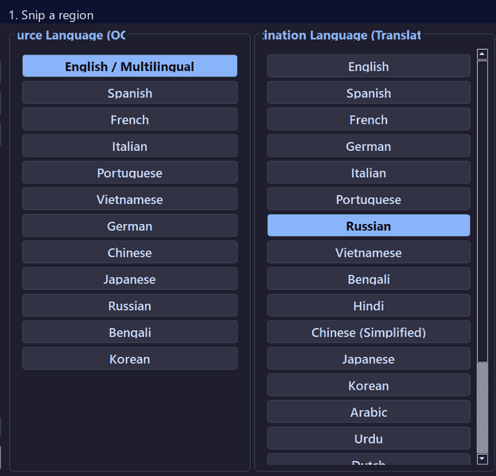

# LingoLens

LingoLens is a Python desktop tool (PyQt5, Flask, EasyOCR, OpenVINO) for screen-snip OCR translation. Select a screen region with a hotkey and read the translation in place, where the original text was.

Originally built with Electron, now a pure Python app with a PyQt5 Control Center, a persistent local OCR server, and transparent overlay windows.



*Real pipeline output: snip a region → OCR detects text → source text removed → translation rendered in place.*

---

## Key features

- Snip a screen region; translation renders in place over the original.
- OCR in 12 languages; translation into 20.
- Local Flask OCR server (EasyOCR loaded once) plus OpenVINO text detection.
- Translation fallback: Google → MyMemory (online). `googletrans` is excluded (v4.0.2 is async-incompatible with this pipeline, not in requirements).
- Background-aware replacement (inpainting), DPI-aware capture, global hotkey `Alt+Shift+M`.

---

## Platform support

**Windows 10/11 x64 only.** The global hotkey hook is win32-only, screen capture is DPI-aware Windows, and install/run instructions below assume Windows. Other platforms are untested and unsupported.

---

## Project structure

```
LingoLens/
├── app.py              # Control Center entry point
├── ui/                 # Control Center UI (windows, theme, widgets, backend)
├── python/
│   ├── ocr_server.py   # Flask OCR API server
│   ├── capture.py      # Screen capture widget
│   ├── detector.py     # OpenVINO text detection
│   ├── blocks.py       # Word/line/block grouping
│   ├── blend.py        # Background removal and overlay render
│   ├── overlay.py      # Overlay windows
│   ├── debug_dump.py   # Per-snip debug artifacts
│   ├── benchmark.py    # Per-stage timings
│   └── translator.py   # Translation fallback
├── assets/
│   └── demo.gif        # Pipeline demo (from a real debug dump)
├── run.py / run.bat    # Launchers
├── icon.png / logo.png # App icons
└── LICENSE             # GPL-3.0
```

---

## Model weights & setup

LingoLens needs **both** EasyOCR and OpenVINO weights at runtime (excluded from git, too large).

1. **EasyOCR**: auto-downloaded on first run (`download_enabled=True`). Or manually from [EasyOCR](https://github.com/JaidedAI/EasyOCR) into `python/EasyOCR/model/`.
2. **OpenVINO**: get `horizontal-text-detection-0001` and `text-detection-0004` (`.xml` + `.bin`) from the [Open Model Zoo](https://github.com/openvinotoolkit/open_model_zoo) and place them in `python/models/`.
   - `horizontal-text-detection-0001.xml` & `.bin`
   - `text-detection-0004.xml` & `.bin`

---

## Installation & quick start

### 1. Prerequisites

- Python 3.10+ (developed and tested on **3.13**).
- `easyocr` pulls in PyTorch, so the first install downloads **multiple GB**.

### 2. Clone & set up
```bash
git clone https://github.com/srnafi/LingoLens.git
cd LingoLens
python -m venv .venv
```

### 3. Install dependencies
- **Windows (Git Bash / CMD / PowerShell)**:
  ```bash
  source .venv/Scripts/activate   # or .venv\Scripts\activate
  pip install -r python/requirements.txt
  ```

### 4. Run
```bash
python run.py
```
(Or double-click `run.bat` on Windows.)

---

## Usage

1. Open the Control Center.
2. Pick source OCR and destination languages.
3. Adjust selection fill, opacity, and border width in Settings (gear button).
4. Press **`Alt+Shift+M`** (or **Snip & Translate**), drag a box around screen text.

The Flask OCR server starts automatically. First run downloads EasyOCR weights.

---

## Debug mode

Set `LINGOLENS_DEBUG=1` to write per-snip artifacts under `debug/<timestamp>/`:
`capture.png`, `boxes.png`, `blocks.png`, `removed.png`, `overlay_rgba.png`, `composite.png`, `detections.json`, `ocr.json`, `blocks.json`, `translations.json`, `metrics.json`, `timings.json`, `env.json`. Add `LINGOLENS_DEBUG_OUTLINE=1` for block outlines.

---

## Testing

```bash
# Compile check
.venv/Scripts/python.exe -m py_compile app.py python/*.py ui/*.py
```

The headless unit suite and pipeline tools under `python/tests/` and `python/tools/` are local dev files, not shipped.

---

## Troubleshooting

| Symptom | Likely cause | Fix |
|---|---|---|
| Overlay is blank | Model weights missing | Complete both steps in Model weights & setup, then restart |
| `Alt+Shift+M` does nothing | Hotkey taken by another app | Close or rebind the other app, then restart |
| First snip is very slow | EasyOCR downloading weights | Wait for the download; later snips are fast |
| Wrong / missing translation | Service rate-limited or offline | Retry; Google → MyMemory needs network |

---

## License

GNU General Public License v3.0 — see [LICENSE](LICENSE).

---

